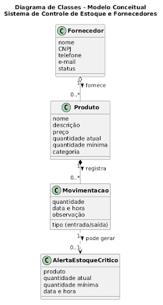
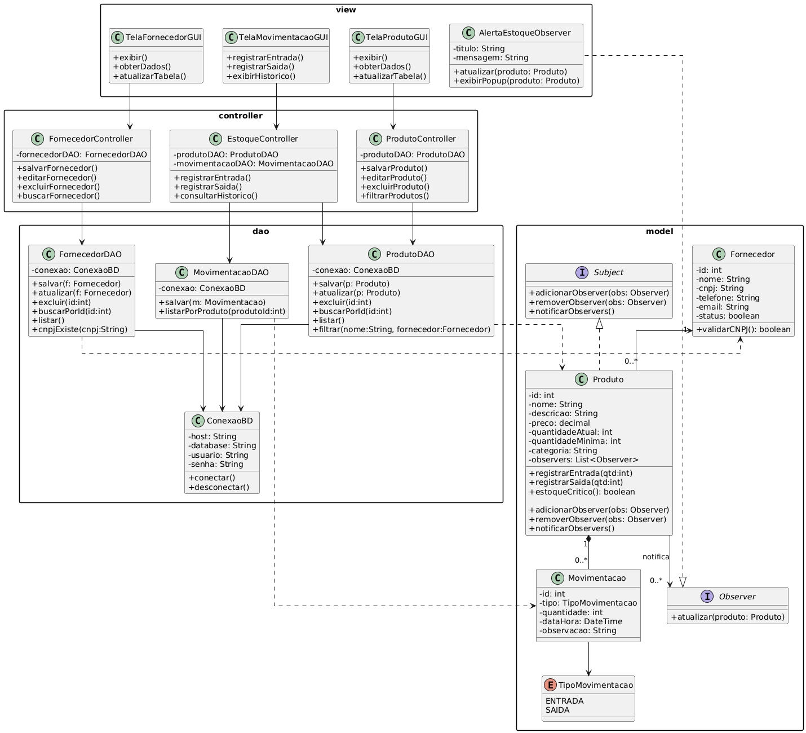
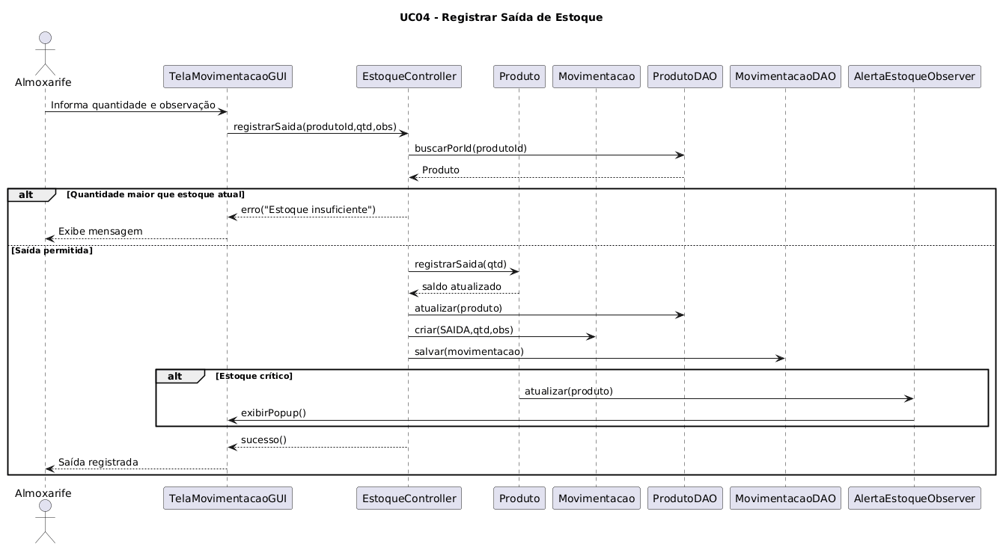

# Documento de Definição de Requisitos 

**Projeto:** Sistema de Controle de Estoque e Fornecedores  
**Responsável:** Gabriel de Oliveira  
**Disciplina:** Análise e Projeto de Sistemas (APS) + Linguagem e Programação Orientada a Objetos (LPOO)  
**Curso:** Bacharelado em Ciência da Computação  

---

## 1. Introdução
Este documento apresenta os requisitos de usuário, as regras de negócio e os artefatos de modelagem arquitetural do Sistema de Controle de Estoque e Fornecedores. O texto está organizado da seguinte forma: a Seção 2 descreve o propósito do sistema; a Seção 3 apresenta o problema a ser resolvido; a Seção 4 detalha as listas de requisitos funcionais, não funcionais e regras de negócio; as seções seguintes expõem os diagramas de Casos de Uso, Classes (Conceitual e Implementação MVC) e Sequência, finalizando com as considerações finais do projeto.

---

## 2. Descrição do Propósito do Sistema
O propósito deste sistema é otimizar o controle de mercadorias e a gestão de fornecedores para pequenas e médias empresas, automatizando o monitoramento dos níveis de estoque, mitigando falhas humanas provenientes de registros manuais e centralizando o histórico de movimentações em uma aplicação desktop local e confiável.

---

## 3. Descrição do Sistema de Controle de Estoque e Fornecedores
Pequenas e médias empresas do setor comercial e industrial frequentemente enfrentam dificuldades no controle manual de estoques, resultando em produtos em falta, fornecedores desorganizados em planilhas dispersas e ausência de histórico de movimentações. 

Neste sistema, foi desenvolvida uma aplicação desktop em Python com interface gráfica (Tkinter) e banco de dados relacional (PostgreSQL). O usuário, atuando como operador de estoque ou almoxarife, gerenciará o cadastro estruturado de fornecedores (com validação de CNPJ) e produtos vinculados. 

O sistema é capaz de registrar todas as entradas e saídas de mercadorias no banco de dados, controlando os saldos para impedir estoques negativos. Além disso, o sistema emitirá alertas automáticos visuais sempre que o saldo de um produto atingir o nível mínimo configurado, permitindo que a equipe tome decisões rápidas de reposição sem dependência de internet.

---

## 4. Requisitos de Usuário

### Requisitos Funcionais

| Identificador | Descrição | Prioridade | Depende de |
| :--- | :--- | :--- | :--- |
| **R.F. 1: Gerenciar Fornecedor** | O sistema deverá permitir o gerenciamento (inclusão, visualização, atualização e exclusão) de fornecedores, informando nome, CNPJ, telefone, e-mail e status. | Alta | |
| **R.F. 2: Validar CNPJ** | O sistema deve validar o formato do CNPJ (`XX.XXX.XXX/XXXX-XX`) no cadastro ou edição do fornecedor. | Alta | R.F. 1 |
| **R.F. 3: Impedir Exclusão de Fornecedor** | O sistema deve impedir a exclusão de um fornecedor que possua produtos vinculados, exibindo mensagem explicativa. | Alta | R.F. 1 |
| **R.F. 4: Gerenciar Produto** | O sistema deverá permitir o gerenciamento (inclusão, visualização, atualização e exclusão) de produtos vinculados a fornecedores, informando nome, descrição, preço, quantidade inicial, quantidade mínima e categoria. | Alta | R.F. 1 |
| **R.F. 5: Registrar Entrada** | O sistema deverá permitir ao usuário registrar uma entrada de estoque para um produto, informando a quantidade recebida e uma observação opcional. | Alta | R.F. 4 |
| **R.F. 6: Registrar Saída** | O sistema deverá permitir ao usuário registrar uma saída de estoque para um produto, informando a quantidade retirada e uma observação opcional. | Alta | R.F. 4 |
| **R.F. 7: Bloquear Saída Indevida** | O sistema deve impedir o registro de uma saída cuja quantidade solicitada seja superior à quantidade disponível em estoque. | Alta | R.F. 6 |
| **R.F. 8: Alerta de Estoque Crítico** | O sistema deve emitir um alerta visual (popup) sempre que a quantidade em estoque for igual ou inferior à quantidade mínima após uma saída. | Alta | R.F. 6 |
| **R.F. 9: Gerar Log de Estoque** | O sistema deve registrar em arquivo de log as ocorrências de estoque abaixo do mínimo (produto, quantidade atual, mínima e data/hora). | Média | R.F. 8 |
| **R.F. 10: Histórico de Movimentações** | O sistema deverá permitir ao usuário visualizar o histórico completo de movimentações de um produto, ordenado do mais recente ao mais antigo. | Alta | R.F. 5, R.F. 6 |
| **R.F. 11: Filtrar Produtos** | O sistema deverá permitir ao usuário filtrar a lista de produtos por nome (busca parcial) e por fornecedor vinculado. | Alta | R.F. 4 |
| **R.F. 12: Filtrar Fornecedores** | O sistema deverá permitir ao usuário filtrar a lista de fornecedores por nome ou CNPJ. | Alta | R.F. 1 |
| **R.F. 13: Tela Sobre** | O sistema deverá exibir uma tela "Sobre" com o nome do sistema, descrição, nome do autor, disciplina e semestre. | Baixa | |

### Regras de Negócio

| Identificador | Descrição | Prioridade | Depende de |
| :--- | :--- | :--- | :--- |
| **R.N. 1** | **Unicidade de CNPJ:** Nenhum dos fornecedores podem ser cadastrados com o mesmo CNPJ. O sistema deve verificar a unicidade antes de confirmar a operação. | Alta | R.F. 1, R.F. 2 |
| **R.N. 2** | **Proteção de Vínculo:** Um fornecedor só pode ser excluído se não houver nenhum produto vinculado a ele. O bloqueio deve informar a quantidade de produtos associados. | Alta | R.F. 3 |
| **R.N. 3** | **Limite de Saída por Estoque:** A quantidade solicitada para saída deve ser estritamente menor ou igual à quantidade atual em estoque. O sistema não deve permitir estoque negativo. | Alta | R.F. 7 |
| **R.N. 4** | **Alerta de Estoque Mínimo:** O nível mínimo é obrigatório (padrão: 5 unidades). Quando atingido, o sistema deve notificar todos os *observers* registrados, independentemente de quantos sejam. | Alta | R.F. 8 |

### Requisitos Não Funcionais

| Identificador | Descrição | Categoria | Escopo | Prioridade | Depende de |
| :--- | :--- | :--- | :--- | :--- | :--- |
| **R.N.F. 1** | O sistema deve conter uma navegação simples por menus, e deve pedir confirmação do usuário antes de apagar qualquer dado. | Usabilidade | Sistema | Alta | R.F. 1, R.F. 4 |
| **R.N.F. 2** | As telas, buscas e registros de dados devem carregar rápido, sem travamentos perceptíveis para o usuário durante o uso diário. | Desempenho | Sistema | Alta | |
| **R.N.F. 3** | O sistema deve garantir que as informações fiquem salvas e organizadas, cancelando e desfazendo a operação se acontecer algum erro no meio do caminho. | Confiabilidade | Sistema | Alta | |
| **R.N.F. 4** | O código do projeto deve ser organized de forma limpa e dividida, facilitando a manutenção ou a troca de componentes se o sistema precisar crescer no futuro. | Manutenibilidade | Sistema | Alta | |
| **R.N.F. 5** | O programa deve funcionar de forma local, rodando direto no computador do usuário sem precisar estar conectado à internet. | Portabilidade | Sistema | Alta | |

---

## 5. Diagrama de Casos de Uso

### Representação Visual do Diagrama

### Relacionamentos e Associações
* **Gestor:** Inicia os casos de uso de gerenciamento estrutural: `UC01: Manter Fornecedor` e `UC02: Manter Produto`.
* **Almoxarife:** Responsável pelas operações físicas diárias: `UC03: Registrar Entrada de Estoque`, `UC04: Registrar Saída de Estoque` e `UC05: Consultar Histórico de Movimentações`.
* **Extensão (<<extend>>):** O `UC06: Emitir Alerta de Estoque Crítico` estende as ações do `UC04`, disparando um fluxo condicional apenas quando a saída de um item reduz seu saldo para um nível menor ou igual ao limite de segurança configurado.

---

## 6. Documentação dos Casos de Uso

### UC01: Manter Fornecedor
* **Atores:** Gestor
* **Pré-condições:** O sistema deve estar aberto na tela de fornecedores.
* **Fluxo Principal:**
  1. O Gestor clica no botão "Novo Fornecedor".
  2. O sistema abre a tela com os campos: Nome, CNPJ, Telefone, E-mail e Status.
  3. O Gestor preenche as informações.
  4. O sistema valida se o CNPJ foi digitado no formato certo (`XX.XXX.XXX/XXXX-XX`) e se já não existe no banco de dados.
  5. O Gestor clica em "Salvar".
  6. O sistema grava os dados e mostra um aviso de sucesso.
* **Fluxos Alternativos:**
  * **Fluxo Alternativo A (CNPJ Errado ou Repetido):** No passo 4, se o CNPJ não passar na validação, o sistema mostra um aviso de erro e não deixa salvar. O fluxo volta para o passo 3.
  * **Fluxo Alternativo B (Apagar Fornecedor com Produto Vinculado):** Se o Gestor tentar excluir um fornecedor que ainda tem produtos associados a ele, o sistema bloqueia a exclusão e avisa quantos produtos estão presos àquele cadastro.
* **Pós-condições:** O fornecedor é cadastrado, alterado ou excluído corretamente no banco de dados.

### UC04: Registrar Saída de Estoque
* **Atores:** Almoxarife
* **Pré-condições:** O produto precisa estar cadastrado e ter quantidade disponível no estoque.
* **Fluxo Principal:**
  1. O Almoxarife escolhe o produto na lista da tela.
  2. O Almoxarife clica em "Registrar Saída".
  3. O sistema pede a quantidade que vai sair e uma observação opcional.
  4. O Almoxarife digita a quantidade desejada.
  5. O sistema checa se a quantidade digitada é menor ou igual ao que tem no estoque hoje.
  6. O sistema diminui a quantidade do saldo do produto e salva a movimentação.
* **Fluxos Alternativos:**
  * **Fluxo Alternativo A (Tentar tirar mais do que tem):** No passo 5, se o Almoxarife tentar tirar uma quantidade maior do que o saldo atual, o sistema exibe uma mensagem de erro na tela avisando que o estoque não pode ficar negativo. A operação é interrompida.
* **Pós-condições:** O saldo do produto diminui e a saída fica registrada no histórico de movimentações.

---

## 7. Diagrama de Classes – Modelo Conceitual
O modelo conceitual representa os conceitos abstratos do mundo real e suas regras associativas sem qualquer acoplamento técnico ou detalhes de tipos de variáveis e bancos de dados.

---

## 8. Diagrama de Classes de Implementação (MVC + DAO)
Este diagrama demonstra o faturamento físico do sistema em pacotes lógicos organizados em Python, atendendo à divisão **Model-View-Controller** combinada à camada de persistência isolada por **Data Access Objects (DAO)**.

### Análise das Camadas e Padrões Aplicados

#### Camada View
Composta por componentes de interface visual construídos sobre a biblioteca gráfica Tkinter (`TelaFornecedorGUI`, `TelaProdutoGUI` e `TelaMovimentacaoGUI`). Esta camada é puramente receptiva e repassa os eventos gerados pelos cliques e digitações dos usuários diretamente para as respectivas controladoras. A classe `AlertaEstoqueObserver` compõe este pacote, encarregando-se de renderizar pop-ups de erro ou avisos visuais.

#### Camada Controller
Responsável por orquestrar os fluxos do sistema e servir de ponte de comunicação desacoplada entre a Visão e o Modelo. 
* **`FornecedorController`** e **`ProdutoController`**: Gerenciam as chamadas de CRUD básicas direcionadas à persistência.
* **`EstoqueController`**: Centraliza os fluxos de movimentações físicas de entrada e saída, coordenando a ordem de validação antes de realizar alterações no banco de dados.

#### Camada Model (Padrão Observer)
Contém as entidades de dados puras e as estruturas comportamentais do padrão **Observer**:
* A interface **`Subject`** e a interface **`Observer`** estabelecem o contrato para notificações assíncronas.
* A classe **`Produto`** realiza `Subject`, armazenando uma lista privada de observadores (`-observers: List<Observer>`). Ao executar seu método interno `registrarSaida()`, se a verificação lógica de `estoqueCritico()` for verdadeira, o objeto notifica instantaneamente seus observadores, disparando o método `atualizar()` na classe concreta `AlertaEstoqueObserver` presente na View, sem conhecer sua estrutura gráfica interna.
* A classe **`Movimentacao`** mapeia de forma coesa se a natureza da alteração é uma entrada ou saída por meio do enumerador estruturado **`TipoMovimentacao`**.

#### Camada DAO (Persistência)
Abstrai todas as rotinas SQL operadas sobre o PostgreSQL:
* A classe unificada **`ConexaoBD`** centraliza os parâmetros de infraestrutura e gerencia de forma segura as chamadas abertas e fechadas de comunicação (`conectar()` e `desconectar()`), eliminando estouros de conexões ou vazamentos de memória (locks) no servidor.
* As classes de persistência específica (`FornecedorDAO`, `ProdutoDAO` e `MovimentacaoDAO`) dependem e utilizam essa conexão para efetuar transações em banco, manipulando exclusivamente objetos tipados do pacote `model`.

---

## 9. Diagrama de Sequência
Este diagrama descreve o fluxo temporal de troca de mensagens do caso de uso mais crítico do sistema: **UC04 - Registrar Saída de Estoque**, mapeando a interação síncrona entre o ator, as fronteiras do MVC, o modelo relacional e o acionamento do padrão Observer.

---

## 10. Considerações Finais
O desenvolvimento do Sistema de Controle de Estoque e Fornecedores conseguiu atingir os objetivos de análise, projeto e implementação que foram pedidos nas disciplinas de APS e LPOO. A mudança do Modelo Conceitual para o Modelo de Implementação ajudou a colocar em prática os requisitos de usabilidade, confiabilidade e portabilidade que foram definidos no começo do projeto.

Usar os padrões de projeto foi muito importante para deixar a arquitetura do software mais organizada. O padrão DAO ajudou a separar os comandos SQL e a conexão com o banco de dados PostgreSQL, fazendo com que as classes do pacote model não dependessem da tecnologia do banco. Já o padrão Observer foi uma solução legal para mostrar alertas quando o estoque está baixo, evitando que o código ficasse muito preso e facilitando a criação de novos tipos de notificações sem precisar mudar o código do objeto Produto.

Por último, a divisão clara em pacotes e a criação de uma interface gráfica desktop usando Tkinter deram às pequenas e médias empresas uma opção segura, prática e eficiente para substituir os controles manuais, mostrando o que aprendemos ao longo do semestre.

---
