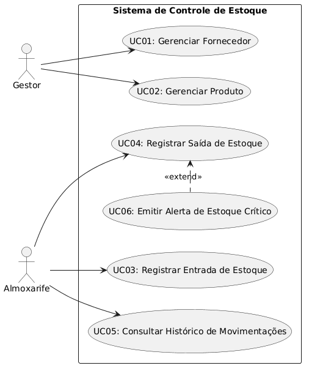

```markdown
# Documento de Definição de Requisitos

**Projeto:** Sistema de Controle de Estoque e Fornecedores
**Responsável:** Gabriel de Oliveira
**Disciplina:** Análise e Projeto de Sistemas (APS) + Linguagem e Programação Orientada a Objetos (LPOO)
**Curso:** Bacharelado em Ciência da Computação

---

## 1. Introdução 
Este documento apresenta os requisitos de usuário do Sistema de Controle de Estoque e Fornecedores e está organizado da seguinte forma : a Seção 2 contém uma descrição do propósito do sistema ; a Seção 3 apresenta uma descrição do sistema apresentando o problema ; e a Seção 4 apresenta as listas de requisitos de usuário e regras de negócio levantados junto ao cliente.

---

## 2. Descrição do Propósito do Sistema 
O propósito deste sistema é otimizar o controle de mercadorias e a gestão de fornecedores para pequenas e médias empresas, automatizando o monitoramento dos níveis de estoque, mitigando falhas humanas provenientes de registros manuais e centralizando o histórico de movimentações em uma aplicação desktop local e confiável.

---

## 3. Descrição do Sistema de Controle de Estoque e Fornecedores 
Pequenas e médias empresas do setor comercial e industrial frequentemente enfrentam dificuldades no controle manual de estoques, resultando em produtos em falta, fornecedores desorganizados em planilhas dispersas e ausência de histórico de movimentações. 

Neste sistema, será desenvolvida uma aplicação desktop em Python com interface gráfica (Tkinter) e banco de dados relacional (PostgreSQL). O usuário, atuando como operador de estoque ou almoxarife, gerenciará o cadastro estruturado de fornecedores (com validação de CNPJ) e produtos vinculados. 

O sistema deve ser capaz de registrar todas as entradas e saídas de mercadorias no banco de dados, controlando os saldos para impedir estoques negativos. Além disso, o sistema emitirá alertas automáticos visuais sempre que o saldo de um produto atingir o nível mínimo configurado, permitindo que a equipe tome decisões rápidas de reposição sem dependência de internet.

---

## 4. Requisitos de Usuário 
Tomando por base o contexto do sistema, foram identificados os seguintes requisitos de usuário e regras de negócio:

### Requisitos Funcionais 

| Identificador | Descrição | Prioridade | Depende de |
| :--- | :--- | :--- | :--- |
| **R.F. 1: Gerenciar Fornecedor**  | O sistema deverá permitir o gerenciamento (inclusão, visualização, atualização e exclusão) de fornecedores, informando nome, CNPJ, telefone, e-mail e status.  | Alta  | |
| **R.F. 2: Validar CNPJ**  | O sistema deve validar o formato do CNPJ (`XX.XXX.XXX/XXXX-XX`) no cadastro ou edição do fornecedor. | Alta  | R.F. 1 |
| **R.F. 3: Impedir Exclusão de Fornecedor**  | O sistema deve impedir a exclusão de um fornecedor que possua produtos vinculados, exibindo mensagem explicativa. | Alta  | R.F. 1 |
| **R.F. 4: Gerenciar Produto**  | O sistema deverá permitir o gerenciamento (inclusão, visualização, atualização e exclusão) de produtos vinculados a fornecedores, informando nome, descrição, preço, quantidade inicial, quantidade mínima e categoria.  | Alta  | R.F. 1 |
| **R.F. 5: Registrar Entrada**  | O sistema deverá permitir ao usuário registrar uma entrada de estoque para um produto, informando a quantidade recebida e uma observação opcional.  | Alta  | R.F. 4 |
| **R.F. 6: Registrar Saída**  | O sistema deverá permitir ao usuário registrar uma saída de estoque para um produto, informando a quantidade retirada e uma observação opcional.  | Alta  | R.F. 4 |
| **R.F. 7: Bloquear Saída Indevida**  | O sistema deve impedir o registro de uma saída cuja quantidade solicitada seja superior à quantidade disponível em estoque. | Alta  | R.F. 6 |
| **R.F. 8: Alerta de Estoque Crítico**  | O sistema deve emitir um alerta visual (popup) sempre que a quantidade em estoque for igual ou inferior à quantidade mínima após uma saída. | Alta  | R.F. 6 |
| **R.F. 9: Gerar Log de Estoque**  | O sistema deve registrar em arquivo de log as ocorrências de estoque abaixo do mínimo (produto, quantidade atual, mínima e data/hora). | Média  | R.F. 8 |
| **R.F. 10: Histórico de Movimentações**  | O sistema deverá permitir ao usuário visualizar o histórico completo de movimentações de um produto, ordenado do mais recente ao mais antigo.  | Alta  | R.F. 5, R.F. 6 |
| **R.F. 11: Filtrar Produtos**  | O sistema deverá permitir ao usuário filtrar a lista de produtos por nome (busca parcial) e por fornecedor vinculado.  | Alta  | R.F. 4 |
| **R.F. 12: Filtrar Fornecedores**  | O sistema deverá permitir ao usuário filtrar a lista de fornecedores por nome ou CNPJ.  | Alta  | R.F. 1 |
| **R.F. 13: Tela Sobre**  | O sistema deverá exibir uma tela "Sobre" com o nome do sistema, descrição, nome do autor, disciplina e semestre.  | Baixa  | |

### Regras de Negócio 

| Identificador | Descrição | Prioridade | Depende de |
| :--- | :--- | :--- | :--- |
| **R.N. 1**  | **Unicidade de CNPJ:** Nenhum dos fornecedores podem ser cadastrados com o mesmo CNPJ. O sistema deve verificar a unicidade antes de confirmar a operação.  | Alta  | R.F. 1, R.F. 2 |
| **R.N. 2**  | **Proteção de Vínculo:** Um fornecedor só pode ser excluído se não houver nenhum produto vinculado a ele. O bloqueio deve informar a quantidade de produtos associados.  | Alta  | R.F. 3 |
| **R.N. 3**  | **Limite de Saída por Estoque:** A quantidade solicitada para saída deve ser estritamente menor ou igual à quantidade atual em estoque. O sistema não deve permitir estoque negativo.  | Alta  | R.F. 7 |
| **R.N. 4**  | **Alerta de Estoque Mínimo:** O nível mínimo é obrigatório (padrão: 5 unidades). Quando atingido, o sistema deve notificar todos os *observers* registrados, independentemente de quantos sejam.  | Alta  | R.F. 8 |

### Requisitos Não Funcionais

| Identificador | Descrição | Categoria | Escopo | Prioridade | Depende de |
| :--- | :--- | :--- | :--- | :--- | :--- |
| **R.N.F. 1** | O sistema deve conter uma navegação simples por menus, e deve pedir confirmação do usuário antes de apagar qualquer dado. | Usabilidade | Sistema | Alta | R.F. 1, R.F. 4 |
| **R.N.F. 2** | As telas, buscas e registros de dados devem carregar rápido, sem travamentos perceptíveis para o usuário durante o uso diário. | Desempenho | Sistema | Alta | |
| **R.N.F. 3** | O sistema deve garantir que as informações fiquem salvas e organizadas, cancelando e desfazendo a operação se acontecer algum erro no meio do caminho. | Confiabilidade | Sistema | Alta | |
| **R.N.F. 4** | O código do projeto deve ser organizado de forma limpa e dividida, facilitando a manutenção ou a troca de componentes se o sistema precisar crescer no futuro. | Manutenibilidade | Sistema | Alta | |
| **R.N.F. 5** | O programa deve funcionar de forma local, rodando direto no computador do usuário sem precisar estar conectado à internet. | Portabilidade | Sistema | Alta | |

## Diagrama de Casos de Uso 

### Representação Visual do Diagrama


---

### Representação Textual do Diagrama
- **Atores:** * `Almoxarife` (Quem faz a movimentação diária do estoque e consulta o histórico).
  - `Gestor` (Quem cuida dos cadastros de fornecedores e produtos).
- **Casos de Uso (UC):**
  - `UC01: Manter Fornecedor` (Cadastrar, editar, excluir).
  - `UC02: Manter Produto` (Cadastrar, editar, excluir).
  - `UC03: Registrar Entrada de Estoque` (Dar entrada em mercadorias recebidas).
  - `UC04: Registrar Saída de Estoque` (Dar saída em mercadorias retiradas).
  - `UC05: Consultar Histórico de Movimentações` (Ver o extrato de entradas e saídas por produto).
  - `UC06: Emitir Alerta de Estoque Crítico` (Aviso em tela de saldo baixo).

### Relacionamentos
- **Gestor** inicia o `UC01: Manter Fornecedor` e o `UC02: Manter Produto`.
- **Almoxarife** inicia o `UC03: Registrar Entrada`, o `UC04: Registrar Saída` e o `UC05: Consultar Histórico`.
- O `UC06: Emitir Alerta de Estoque Crítico` **estende (`<<extend>>`)** o `UC04`, já que o estoque só corre o risco de acabar quando houver uma saída de mercadoria.

---

## Documentação dos Casos de Uso 

### UC01: Manter Fornecedor
* **Atores:** Gestor
* **Pré-condições:** O sistema deve estar aberto na tela de fornecedores.
* **Fluxo Principal:**
  1. O Gestor clica no botão "Novo Fornecedor".
  2. O sistema abre a tela com os campos: Nome, CNPJ, Telefone, E-mail e Status.
  3. O Gestor preenche as informações.
  4. O sistema valida se o CNPJ foi digitado no formato certo (`XX.XXX.XXX/XXXX-XX`) e se já não existe no banco de dados.
  5. O Gestor clica em "Salvar".
  6. O sistema grava os dados e mostra um aviso de sucesso.
* **Fluxos Alternativos:**
  * **Fluxo Alternativo A (CNPJ Errado ou Repetido):** No passo 4, se o CNPJ não passar na validação, o sistema mostra um aviso de erro e não deixa salvar. O fluxo volta para o passo 3.
  * **Fluxo Alternativo B (Apagar Fornecedor com Produto Vinculado):** Se o Gestor tentar excluir um fornecedor que ainda tem produtos associados a ele, o sistema bloqueia a exclusão e avisa quantos produtos estão presos àquele cadastro.
* **Pós-condições:** O fornecedor é cadastrado, alterado ou excluído corretamente no banco de dados.

---

### UC02: Manter Produto
* **Atores:** Gestor
* **Pré-condições:** Deve existir pelo menos um fornecedor cadastrado no sistema.
* **Fluxo Principal:**
  1. O Gestor acessa a tela de produtos e clica em "Novo Produto".
  2. O sistema abre um formulário pedindo: Nome, Descrição, Preço, Quantidade Inicial, Quantidade Mínima, Categoria e Fornecedor Responsável.
  3. O Gestor seleciona o fornecedor correto na lista de opções.
  4. O Gestor preenche o restante dos dados do produto e clica em "Salvar".
  5. O sistema grava o produto associando-o ao fornecedor escolhido.
* **Fluxos Alternativos:**
  * **Fluxo Alternativo A (Quantidade Mínima não preenchida):** No passo 4, se o Gestor deixar o campo de quantidade mínima em branco, o sistema assume automaticamente o valor padrão de 5 unidades e salva o produto normalmente.
* **Pós-condições:** O produto é criado ou editado no banco de dados com seu respectivo fornecedor vinculado.

---

### UC03: Registrar Entrada de Estoque
* **Atores:** Almoxarife
* **Pré-condições:** O produto precisa estar cadastrado no sistema.
* **Fluxo Principal:**
  1. O Almoxarife busca o produto pelo nome ou usando filtros na tela principal.
  2. Ele seleciona o produto e clica em "Registrar Entrada".
  3. O sistema abre uma janelinha pedindo a quantidade recebida e uma observação opcional.
  4. O Almoxarife preenche os dados e clica em "Confirmar".
  5. O sistema soma a nova quantidade ao saldo atual do estoque e guarda a movimentação.
* **Fluxos Alternativos:** Nenhum.
* **Pós-condições:** O saldo do produto é aumentado e a entrada fica salva no histórico.

---

### UC04: Registrar Saída de Estoque
* **Atores:** Almoxarife
* **Pré-condições:** O produto precisa estar cadastrado e ter quantidade disponível no estoque.
* **Fluxo Principal:**
  1. O Almoxarife escolhe o produto na lista da tela.
  2. O Almoxarife clica em "Registrar Saída".
  3. O sistema pede a quantidade que vai sair e uma observação opcional.
  4. O Almoxarife digita a quantidade desejada.
  5. O sistema checa se a quantidade digitada é menor ou igual ao que tem no estoque hoje.
  6. O sistema diminui a quantidade do saldo do produto e salva a movimentação.
* **Fluxos Alternativos:**
  * **Fluxo Alternativo A (Tentar tirar mais do que tem):** No passo 5, se o Almoxarife tentar tirar uma quantidade maior do que o saldo atual, o sistema joga uma mensagem de erro na tela avisando que o estoque não pode ficar negativo. A operação para e volta para o passo 3.
* **Pós-condições:** O saldo do produto diminui e a saída fica registrada no histórico de movimentações.

---

### UC05: Consultar Histórico de Movimentações
* **Atores:** Almoxarife
* **Pré-condições:** O produto selecionado deve ter passado por pelo menos uma entrada ou saída anterior.
* **Fluxo Principal:**
  1. O Almoxarife clica no produto desejado na tabela principal.
  2. Ele seleciona a opção "Ver Histórico".
  3. O sistema abre uma tela listando todas as entradas e saídas daquele item específico.
  4. A listagem exibe o tipo de operação, a quantidade movimentada, a data/hora exata e a observação que foi digitada.
  5. O sistema organiza os dados do mais recente para o mais antigo.
* **Fluxos Alternativos:**
  * **Fluxo Alternativo A (Produto sem histórico):** No passo 3, se o produto nunca tiver sofrido nenhuma entrada ou saída (apenas o saldo inicial do cadastro), o sistema exibe uma tabela limpa informando "Nenhuma movimentação registrada para este produto".
* **Pós-condições:** O Almoxarife consegue visualizar todo o extrato de movimentação do item.

---

### UC06: Emitir Alerta de Estoque Crítico
* **Atores:** Nenhum (É disparado automaticamente pelo sistema).
* **Pré-condições:** O `UC04 (Registrar Saída de Estoque)` precisa ter sido concluído com sucesso.
* **Fluxo Principal:**
  1. O sistema checa o novo saldo do produto logo após a saída ser confirmada.
  2. O sistema percebe que a quantidade atual ficou igual ou menor do que a "quantidade mínima" que foi configurada para aquele produto.
  3. O sistema abre uma janela pop-up na tela avisando visualmente o usuário que o produto atingiu o nível crítico e precisa de reposição.
* **Fluxos Alternativos:**
  * **Fluxo Alternativo A (Estoque ainda está seguro):** No passo 2, se o saldo do produto continuar maior do que o mínimo configurado, o caso de uso termina sem abrir nenhuma janela na tela.
* **Pós-condições:** O usuário é avisado na tela sobre o estoque baixo do produto.


```